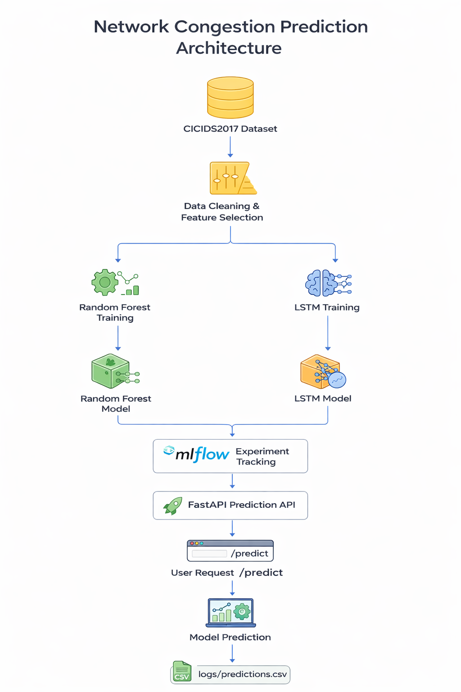

# Network Congestion Prediction using Machine Learning

## Project Overview
This project implements an end-to-end MLOps workflow for network congestion prediction using the CICIDS2017 dataset.

The workflow includes data loading, cleaning, model training, experiment tracking with MLflow, best model selection, deployment using FastAPI, and prediction logging for monitoring.

The goal is to build a reproducible and deployment-ready machine learning pipeline for analyzing network traffic behavior.

## Problem Statement
Modern networks generate large amounts of traffic data, and abnormal traffic patterns may indicate congestion, inefficiency, or malicious activity.

The objective of this project is to use machine learning and deep learning techniques to analyze network flow data and predict traffic conditions effectively.

## Dataset
- **Dataset:** CICIDS2017
- **Type:** Network traffic / flow-based dataset
- **Why used:** It contains realistic network flow features suitable for training and evaluating machine learning models for traffic analysis.

## Architecture Diagram


## Project Pipeline
Dataset → Data Loading → Data Cleaning → Feature Selection → Model Training → MLflow Tracking → Best Model Selection → FastAPI Deployment → Prediction Logging

## Project Structure
```text
network-congestion-prediction/
│
├── data/
│   ├── raw/
│   └── processed/
│
├── docs/
│   └── images/
│       └── system_architecture.png.png
│
├── logs/
│   └── predictions.csv
│
├── models/
│   └── random_forest_model.pkl
│
├── src/
│   ├── data/
│   │   ├── load_data.py
│   │   └── clean_data.py
│   └── deployment/
│       └── app.py
│
├── README.md
├── requirements.txt
<<<<<<< HEAD
└── main.py

## Models Used

### Random Forest
- A machine learning model suitable for structured tabular data
- Easy to train and deploy
- Performed better in this project

### LSTM
- A deep learning model suitable for sequential or time-series learning
- Used to compare deep learning with a classical machine learning approach
- Performed lower than Random Forest for this dataset

## Model Performance / Results
| Model | Accuracy | Notes |
|------|----------|------|
| Random Forest | ~99% | Strong performance on structured traffic features |
| LSTM | ~85% | Lower performance because the dataset is mainly tabular |

## Model Performance / Results
| Model | Accuracy | Notes |
|------|----------|------|
| Random Forest | ~99% | Strong performance on structured traffic features |
| LSTM | ~85% | Lower performance because the dataset is mainly tabular |

## Best Model Selection
The best model is selected by comparing evaluation metrics from all trained models.

The pipeline uses comparison logic defined in the code. After training the candidate models, their performance is evaluated on validation or test data, and the results are logged into MLflow.

The model with the better performance is selected as the final production model.

In this project, **Random Forest** was selected as the final deployed model.

## MLflow Usage
MLflow was used to track and compare experiments.

The following were logged:
- Model name
- Parameters
- Metrics
- Runs
- Artifacts

MLflow improves reproducibility and supports transparent best model selection.

## API Deployment
The final selected model is deployed using **FastAPI**.

### Endpoint
`POST /predict`

### Example Input
```json
{
  "Destination_Port": 443,
  "Flow_Duration": 120,
  "Total_Fwd_Packets": 10,
  "Total_Backward_Packets": 8,
  "Total_Length_of_Fwd_Packets": 1200,
  "Total_Length_of_Bwd_Packets": 900,
  "Fwd_Packet_Length_Max": 300,
  "Fwd_Packet_Length_Min": 50,
  "Fwd_Packet_Length_Mean": 120,
  "Fwd_Packet_Length_Std": 30
}

{
  "prediction": 0,
  "label": "BENIGN"
}


### 13. Prediction Logging / Monitoring
```markdown
## Prediction Logging / Monitoring
All predictions are logged in:

`logs/predictions.csv`

This supports:
- Monitoring deployed predictions
- Traceability
- Debugging
- Auditing outputs
- Supporting future retraining

## Created by:
**Abdul Jamil Azizi**

## Supervised by:
**Professor Forooz Shahbazi Avarvand**


└── main.py
 b917ee4 (Clean README and add reviewable project files)
