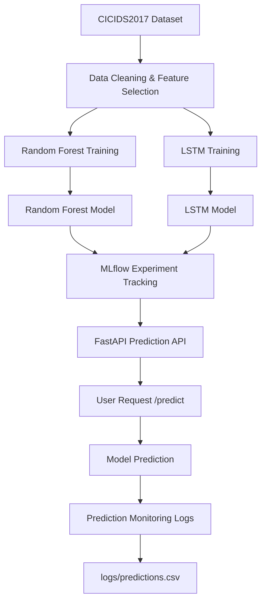

# Network Congestion Prediction using Machine Learning

## Project Overview
This project implements a machine learning system to detect abnormal network traffic and potential congestion.

The system trains a Random Forest model using the CICIDS2017 dataset and deploys the model using FastAPI.

## System Architecture

## Model Performance Comparison

Two models were trained to predict network congestion using the CICIDS2017 dataset.

| Model | Type | Accuracy | Notes |
|------|------|------|------|
| Random Forest | Machine Learning | ~99% | Works very well with tabular network traffic features |
| LSTM | Deep Learning | ~85% | Designed for sequential data, but dataset is mostly tabular |

### Conclusion

Random Forest achieved higher accuracy because the dataset contains structured tabular features rather than sequential time-series traffic.

However, LSTM demonstrates how deep learning models can also be applied to network anomaly detection tasks.

### Conclusion

Random Forest achieved higher accuracy because the dataset contains structured tabular features rather than sequential time-series traffic.

However, LSTM demonstrates how deep learning models can also be applied to network anomaly detection tasks.


---

## Technologies Used

- Python
- Scikit-learn
- FastAPI
- MLflow
- Pandas
- Git & GitHub

---

## Project Pipeline

Dataset → Data Cleaning → Model Training → MLflow Tracking → API Deployment → Monitoring

---

## Model Deployment

The trained model is deployed using FastAPI.

Run the API:
=======
\# Machine Learning-Based Network Congestion Detection


\## Project Overview


This project implements a machine learning pipeline to detect abnormal network traffic and potential congestion using network flow data.


The system trains a Random Forest model on the CICIDS2017 dataset and deploys the model as an API using FastAPI.


\## Features


\* Network traffic anomaly detection

\* MLflow experiment tracking

\* FastAPI deployment

\* Prediction monitoring

\* GitHub version control


\## Tech Stack


\* Python

\* Scikit-learn

\* FastAPI

\* MLflow

\* Pandas

\* Git \& GitHub


\## Project Architecture


Dataset → Data Cleaning → Model Training → MLflow Tracking → Model Deployment → Prediction API → Monitoring Logs


\## API Endpoint


POST `/predict`


Example request:


```json

{

&#x20; "Destination\_Port": 443,

&#x20; "Flow\_Duration": 120,

&#x20; "Total\_Fwd\_Packets": 10,

&#x20; "Total\_Backward\_Packets": 8,

&#x20; "Total\_Length\_of\_Fwd\_Packets": 1200,

&#x20; "Total\_Length\_of\_Bwd\_Packets": 900,

&#x20; "Fwd\_Packet\_Length\_Max": 300,

&#x20; "Fwd\_Packet\_Length\_Min": 50,

&#x20; "Fwd\_Packet\_Length\_Mean": 120,

&#x20; "Fwd\_Packet\_Length\_Std": 30

}

```


\## Output


```

{

&#x20;"prediction": 0,

&#x20;"label": "BENIGN"

}

```


\## Monitoring


All predictions are logged in:


```

logs/predictions.csv

```


\## Author


Master AI/ML Project


>>>>>>> 8bf669d (Added architecture diagram)
