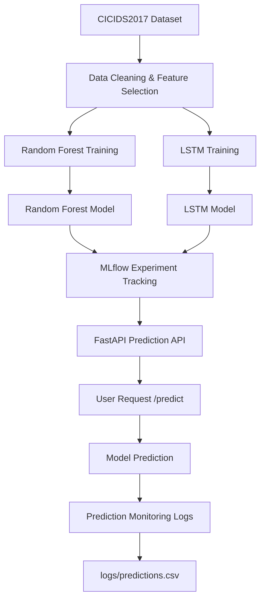

# Network Congestion Prediction using Machine Learning

## Project Overview
This project implements a machine learning system to detect abnormal network traffic and potential congestion.

The system trains a Random Forest model using the CICIDS2017 dataset and deploys the model using FastAPI.

## System Architecture
## Model Performance Comparison

Two models were trained to predict network congestion using the CICIDS2017 dataset.

| Model | Type | Accuracy | Notes |
|------|------|------|------|
| Random Forest | Machine Learning | ~99% | Works very well with tabular network traffic features |
| LSTM | Deep Learning | ~85% | Designed for sequential data, but dataset is mostly tabular |

### Conclusion

Random Forest achieved higher accuracy because the dataset contains structured tabular features rather than sequential time-series traffic.

However, LSTM demonstrates how deep learning models can also be applied to network anomaly detection tasks.

## Model Performance Comparison

Two models were trained to predict network congestion using the CICIDS2017 dataset.

| Model | Type | Accuracy | Notes |
|------|------|------|------|
| Random Forest | Machine Learning | ~99% | Works very well with tabular network traffic features |
| LSTM | Deep Learning | ~85% | Designed for sequential data, but dataset is mostly tabular |

### Conclusion

Random Forest achieved higher accuracy because the dataset contains structured tabular features rather than sequential time-series traffic.

However, LSTM demonstrates how deep learning models can also be applied to network anomaly detection tasks.

---

## Technologies Used

- Python
- Scikit-learn
- FastAPI
- MLflow
- Pandas
- Git & GitHub

---

## Project Pipeline

Dataset → Data Cleaning → Model Training → MLflow Tracking → API Deployment → Monitoring

---

## Model Deployment

The trained model is deployed using FastAPI.

Run the API:
