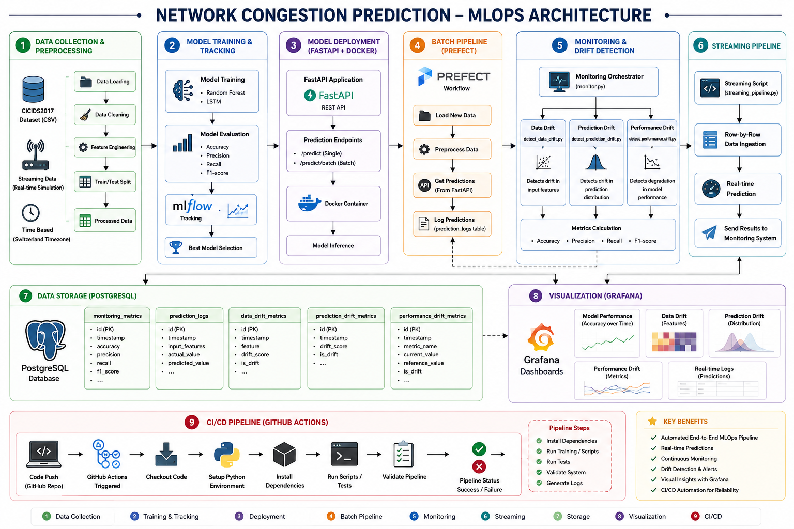

# 🚀 Network Congestion Prediction using MLOps

This project implements a complete **end-to-end MLOps pipeline** for predicting network congestion. It includes training, deployment, monitoring, streaming, and CI/CD automation.

---

# 📌 Project Overview

The system:
- Predicts network congestion using ML models
- Automates training & deployment
- Monitors performance and detects drift
- Simulates real-time streaming data
- Uses CI/CD for automation

---

# 🧠 MLOps Architecture

---

# 🏗️ Project Structure

01_model_tracking/  
02_training_pipeline/  
03_dockerization_and_deployment/  
04_monitoring/  
05_streaming/  
.github/  
README.md  

---

# ⚙️ Stage 1: Model Tracking (MLflow)

- Models: Random Forest, LSTM  
- Tracks experiments, metrics, and parameters  
- Selects best model  

---

# 🤖 Stage 2: Training Pipeline

- Data preprocessing  
- Feature engineering  
- Model training & evaluation  

---

# 🐳 Stage 3: Deployment

- FastAPI REST API  
- Docker containerization  
- Supports batch & API prediction  

Run API:
uvicorn src.deployment.app:app --reload  

---

# 🔄 Stage 4: Batch Pipeline (Prefect)

- Workflow orchestration  
- Loads data → preprocess → predict → store logs  

---

# 📊 Stage 5: Monitoring & Drift Detection

Metrics:
- Accuracy, Precision, Recall, F1-score  

Drift:
- Data Drift  
- Prediction Drift  
- Performance Drift  

---

# 🗄️ Stage 6: Database (PostgreSQL)

Stores:
- monitoring_metrics  
- prediction_logs  
- drift metrics  

---

# 📈 Stage 7: Visualization (Grafana)

Dashboards:
- Model performance  
- Drift detection  
- Real-time logs  

---

# 🔄 Stage 8: Streaming Pipeline

- Simulates real-time data  
- Sends row-by-row predictions  

Run:
python 05_streaming/streaming_pipeline.py  

---

# 🔁 Stage 9: CI/CD Pipeline

Implemented using GitHub Actions:

- Trigger on every push  
- Install dependencies  
- Run scripts  
- Validate pipeline  

Workflow:
Code Push → Actions → Run → Validate → Success  

---

# 🧠 System Flow

Data → Training → Model → Deployment → Streaming → Monitoring → Database → Grafana → CI/CD  

---

# 📊 Technologies

Python, Scikit-learn, TensorFlow, MLflow, FastAPI, Docker, PostgreSQL, Grafana, Prefect, GitHub Actions  

---

# ▶️ Run Project

docker-compose up  
python 04_monitoring/scripts/monitor.py  
python 05_streaming/streaming_pipeline.py  
uvicorn src.deployment.app:app --reload  

---

# 🎤 Summary

Complete MLOps pipeline with automation, monitoring, and CI/CD.

---

# 👨‍💻 Author

Abdul Jamil Azizi
